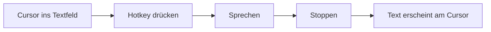
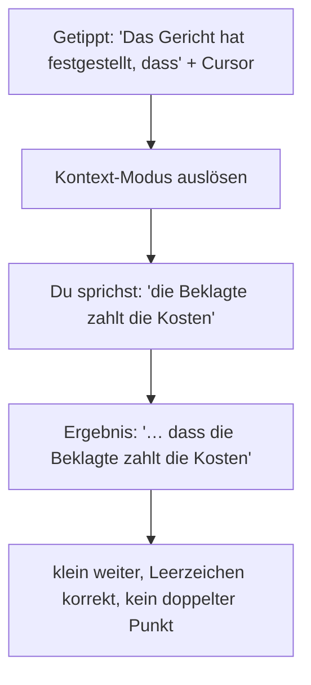

# BlitzBrief – Anwenderhandbuch

> **Stand:** 2026-06-29 · Generiert über `/doku-erstellen`

BlitzBrief verwandelt gesprochenes Wort in Text – direkt dort, wo dein Cursor steht, in fast jeder Anwendung (Word, Outlook, Browser, Editor …). Du drückst einen Hotkey, sprichst, und der fertige Text erscheint an der Cursorposition.

---

## 1. In 30 Sekunden startklar

1. **API-Key hinterlegen:** Einstellungen öffnen (Doppelklick aufs Tray-Symbol) → OpenAI API Key einfügen → speichern. Der Key bleibt lokal und verschlüsselt auf deinem Rechner.
2. **Mikrofon prüfen:** in den Einstellungen unter „Mikrofon" das richtige Gerät wählen.
3. **Loslegen:** Cursor in ein Textfeld setzen, Hotkey drücken, sprechen, Hotkey loslassen/erneut drücken – fertig.

---

## 2. Bedienung

Du kannst jeden Modus auf vier Wegen starten:

- **Hotkey** (global, funktioniert in jeder App) – Standardbelegung siehe **Merkblatt**. Standard: BlitzBrief = Strg+Alt+Leer, Blitzbrief-Easy = Strg+Win, Blitzbrief-Kontext = Strg+Umschalt, Blitzbrief-Kontext (GPT) = Strg+Leer, Text verbessern/Ärger beruhigen/Emoji = Strg+Alt+1/2/3.
- **Doppeltipp** auf einen Modifier (z. B. zweimal schnell Strg) – wie bei Wispr Flow.
- **Floating-Toolbar** – die schwebende Leiste mit Buttons.
- **Tray-Menü** – Rechtsklick aufs BlitzBrief-Symbol unten rechts.

**Zwei Aufnahme-Modi** (Einstellung „Hotkey-Modus", Standard **Halten**):
- **Halten (Hold):** gedrückt halten zum Sprechen, loslassen beendet.
- **Umschalten (Toggle):** einmal drücken startet, nochmal drücken stoppt.

> 💡 Die Toolbar „klaut" den Fokus nicht – dein Cursor bleibt im Zieltext, auch wenn du auf einen Button klickst.

---

## 3. Die Modi im Überblick

| Modus | Was er tut | Wofür |
|---|---|---|
| **BlitzBrief** | Reine Transkription, 1:1 | Schnelles Diktat ohne Schnickschnack |
| **Text verbessern** | Transkription + KI-Überarbeitung (Stil wählbar) | Aus gesprochenem Rohtext sauberen Text machen |
| **Blitzbrief-Easy** | Diktat mit Kommandos (Komma, Satzende …), **ohne** KI-Umschreiben | Wörtliches Diktat mit Satzzeichen-Steuerung, v. a. juristische Texte |
| **Blitzbrief-Kontext** | Wie Easy, **setzt aber den angefangenen Satz fort** (whisper-1) | Mitten in einen Satz hinein weiterdiktieren |
| **Blitzbrief-Kontext (GPT)** | Wie Kontext, aber mit gpt-4o-transcribe und Kontext **links + rechts** | Einschübe, bei denen das Modell die Einfügestelle „verstehen" soll; geringere Latenz dank Echtzeit |
| **Ärger beruhigen** | Formuliert eine emotionale Nachricht sachlich/lösungsorientiert um | Wütende E-Mail entschärfen |
| **Emoji ergänzen** | Behält den Text, streut passende Emojis ein | Lockere Nachrichten aufpeppen |

### „Text verbessern" – Stile

- **Formell / Neutral / Locker:** KI korrigiert und formuliert im gewählten Ton.
- **Jörn (minimal):** entfernt nur Füllwörter (äh, ähm, halt …), behält deine Wortwahl exakt.
- **Jörn 2 (Kommandos):** wie minimal, **plus** Diktierbefehle (Komma, Satzende …) und juristische Schreibweise – aber kein Umformulieren.

---

## 4. Diktieren mit Kommandos (Easy, Kontext, Kontext (GPT), „Jörn 2")

In diesen Modi sprichst du Satzzeichen und Layout einfach mit:

> „Sehr geehrte Frau Müller **Komma** **neue Zeile** wir bestätigen den Eingang **Satzende**"

wird zu:

> Sehr geehrte Frau Müller,
> wir bestätigen den Eingang.

Die vollständige Kommandoliste steht im **Kommando-Merkblatt** (`kommando-merkblatt.md`).

Zusätzlich werden Zeichen automatisch gesetzt, sobald eine Zahl folgt: „Paragraph 323" → **§ 323**, „500 Euro" → **500 €**.

---

## 5. Die Kontext-Modi genauer (Weiterdiktieren mitten im Satz)

Beide Kontext-Modi lesen (zerstörungsfrei, ohne deine Zwischenablage anzufassen) den angefangenen Satz **links** und den Text **rechts** vom Cursor und sorgen dafür, dass deine Fortsetzung nahtlos passt:

Beide Modi erledigen automatisch:
- **Richtige Groß-/Kleinschreibung:** Fortsetzung beginnt klein, wenn der Satz noch offen ist (Namen/Substantive bleiben groß).
- **Leerzeichen mit Zeichengefühl:** setzt vorne/hinten ein Leerzeichen, wenn nötig. Beginnt dein Diktat mit einem anhängenden Satzzeichen (`,` `:` `;` `.` `!` `?` `)`), kommt **kein** Leerzeichen davor (`…festgestellt, dass` statt `…festgestellt , dass`). Bei öffnendem Anführungszeichen, `§` oder Gedankenstrich wird das Leerzeichen davor gesetzt.
- **Kein doppelter Punkt:** beim Einfügen mitten in einen Satz entfällt der automatische Schlusspunkt.
- **Führende Stille wird abgeschnitten** (Silero), damit dein Wortanlaut sauber ankommt.

### Welcher der beiden?

- **Blitzbrief-Kontext** (Strg+Umschalt): nutzt **whisper-1**. Sehr zuverlässige Klein-Fortsetzung, läuft per Upload nach dem Stopp.
- **Blitzbrief-Kontext (GPT)** (Strg+Leer): nutzt **gpt-4o-transcribe** und gibt dem Modell den Kontext links **und** rechts mit. Streamt live (geringere Latenz). Welches Modell genutzt wird, stellst du in den Einstellungen unter **„Kontext-GPT Modell"** ein – für korrekte Groß-/Kleinschreibung wird **`gpt-4o-transcribe`** empfohlen (das kleinere `gpt-4o-mini-transcribe` schreibt eingefügte Einzelwörter oft groß).

> ℹ️ Im Debug-Fenster zeigt ein Lämpchen oben, ob die Echtzeit-Transkription genutzt wurde (grün) oder auf den klassischen Upload zurückgefallen ist (grau).

> ⚠️ Funktioniert am besten in Apps mit guter Textunterstützung (Word, Outlook, Edge/Chrome, Editor). In Apps ohne Textzugriff verhält sich der Modus wie Easy.

---

## 6. Einstellungen

- **OpenAI API Key:** lokal & verschlüsselt; einfügen/speichern/löschen.
- **Sprache:** Deutsch, Englisch oder automatisch.
- **Transkriptionsmodell** und **Kontext-GPT Modell** (für „Blitzbrief-Kontext (GPT)").
- **Hotkeys:** pro Modus frei belegbar (ins Feld klicken, Kombination drücken; mind. zwei Modifier oder Modifier + Taste).
- **Hotkey-Modus:** Toggle oder Hold.
- **Doppeltipp:** an/aus + Modifier (Strg/Alt/Umschalt).
- **Mikrofon:** Gerät wählen, Status prüfen.
- **Schnellstart/Latenz:** Pre-Roll (Mikro dauerhaft aktiv für sofortigen Start) und Echtzeit-Transkription.
- **Eigenbegriffe:** Namen/Fachbegriffe, die korrekt geschrieben werden sollen.
- **Auto-Einfügen:** Text automatisch per Strg+V einfügen (sonst nur in die Zwischenablage).
- **Zurücksetzen:** „Allgemeine Einstellungen zurücksetzen" stellt Sprache, Modell, Hotkey-Modus, Auto-Einfügen, Echtzeit, Doppeltipp und Pre-Roll auf die Standardwerte zurück (Hotkey-Belegungen, Prompts und Eigenbegriffe bleiben unberührt).

---

## 7. Wenn mal nichts passiert

- **Kein Text eingefügt?** API-Key gesetzt? Mikrofon korrekt gewählt? Aufnahme evtl. zu kurz (< 0,35 s wird ignoriert).
- **Falsche Schreibweise von Namen?** Begriff unter „Eigenbegriffe" eintragen.
- **„Kontext (GPT)" schreibt Einzelwörter groß?** In den Einstellungen das Kontext-GPT-Modell auf **`gpt-4o-transcribe`** stellen.
- **Kontext-Fortsetzung klappt nicht?** Die App braucht Textzugriff auf die Zielanwendung; in manchen Apps ist das nicht möglich – dort wirkt der Modus wie Easy.
- **Kommandowort erscheint als Wort statt als Zeichen?** Nur Easy/Kontext/Kontext (GPT)/„Jörn 2" setzen Kommandos um – im reinen „BlitzBrief"-Modus nicht.
