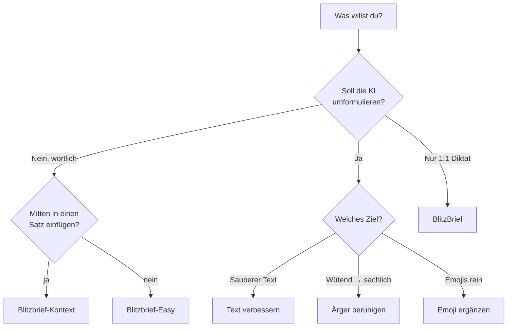

# BlitzBrief – Merkblatt (Kommandos & Do's/Don'ts)

> **Stand:** 2026-06-28 · Generiert über `/doku-erstellen` · Eine Seite zum Ausdrucken

## Diktierbefehle (Easy · Kontext · „Jörn 2")

| Sprich … | … erscheint als |
|---|---|
| **Komma** | , |
| **Satzende** | . |
| **Doppelpunkt** | : |
| **Semikolon** | ; |
| **Ausrufezeichen** | ! |
| **Fragezeichen** | ? |
| **Gedankenstrich** | — |
| **Klammer auf** / **Klammer zu** | ( ) |
| **Anführungszeichen auf** / **… zu** | " " |
| **neue Zeile** | ↵ (Zeilenumbruch) |
| **neuer Absatz** / **Leerzeile** | ↵↵ (Leerzeile) |
| **Text einrücken** | 4 Leerzeichen |

**Automatisch (alle Modi), sobald eine Zahl folgt:**
„Paragraph 5" → **§ 5** · „500 Euro" → **500 €**

---

## Modus-Spickzettel

| Modus | Hotkey | Kommandos? | KI schreibt um? |
|---|---|---|---|
| BlitzBrief | Strg+Alt+Leer | ✗ | ✗ |
| Text verbessern | Strg+Alt+1 | nur „Jörn 2" | ✓ (außer SkipRewrite) |
| Ärger beruhigen | Strg+Alt+2 | ✗ | ✓ |
| Emoji ergänzen | Strg+Alt+3 | ✗ | ✓ |
| Blitzbrief-Easy | Strg+Win | ✓ | ✗ |
| Blitzbrief-Kontext | Strg+Umschalt | ✓ | ✗ |

*(Hotkeys sind Standardwerte und in den Einstellungen änderbar. Aufnahme-Modus standardmäßig „Halten".)*

---

## ✅ Do's

- **Kommandowörter deutlich und einzeln sprechen** („… Müller **Komma** wir …"), mit kleiner Pause davor/danach.
- **Eigennamen/Fachbegriffe vorab eintragen** (Einstellungen → Eigenbegriffe), damit sie korrekt geschrieben werden.
- **Kontext-Modus für Einschübe:** Cursor wirklich an die Stelle setzen, an der weitergeschrieben werden soll – BlitzBrief liest links *und* rechts und passt Groß-/Kleinschreibung, Leerzeichen und Schlusspunkt an. Beginnt dein Diktat mit `,` `:` `;` o. Ä., klebt es korrekt an (kein Leerzeichen davor); öffnende Anführungszeichen, `§` und Gedankenstrich bekommen automatisch ein Leerzeichen davor.
- **Mindestens ~1 Sekunde sprechen** – sehr kurze Schnipsel werden zum Schutz vor Fehltranskriptionen teils verworfen.
- **Richtigen Modus wählen:** wörtlich/juristisch → Easy/Kontext; Rohtext aufpolieren → Text verbessern.

## ❌ Don'ts

- **Kein** Kommando-Diktat im reinen **BlitzBrief**-Modus erwarten – dort wird „Komma" als Wort geschrieben.
- **Nicht** im Easy/Kontext/„Jörn 2" auf Umformulierung hoffen – diese Modi bereinigen nur, sie schreiben **nicht** um.
- **Nicht** den Kontext-Modus für komplett neue Absätze nutzen – seine Stärke ist das **Fortsetzen** eines angefangenen Satzes.
- **Nicht** mitten im Satz etwas diktieren, das selbst auf eine Abkürzung mit Punkt endet (z. B. „… z. B.") – der Schlusspunkt würde im Kontext-Modus mit entfernt.
- **Nicht** erwarten, dass der Kontext-Modus in jeder App den Satz liest – Apps ohne Textzugriff fallen auf Easy-Verhalten zurück.
- **Nicht** während der Aufnahme die Zielanwendung wechseln – Cursor-Kontext und Einfügen beziehen sich auf das Fenster beim Start.

---

## Schnell-Entscheidung: Welcher Modus?

