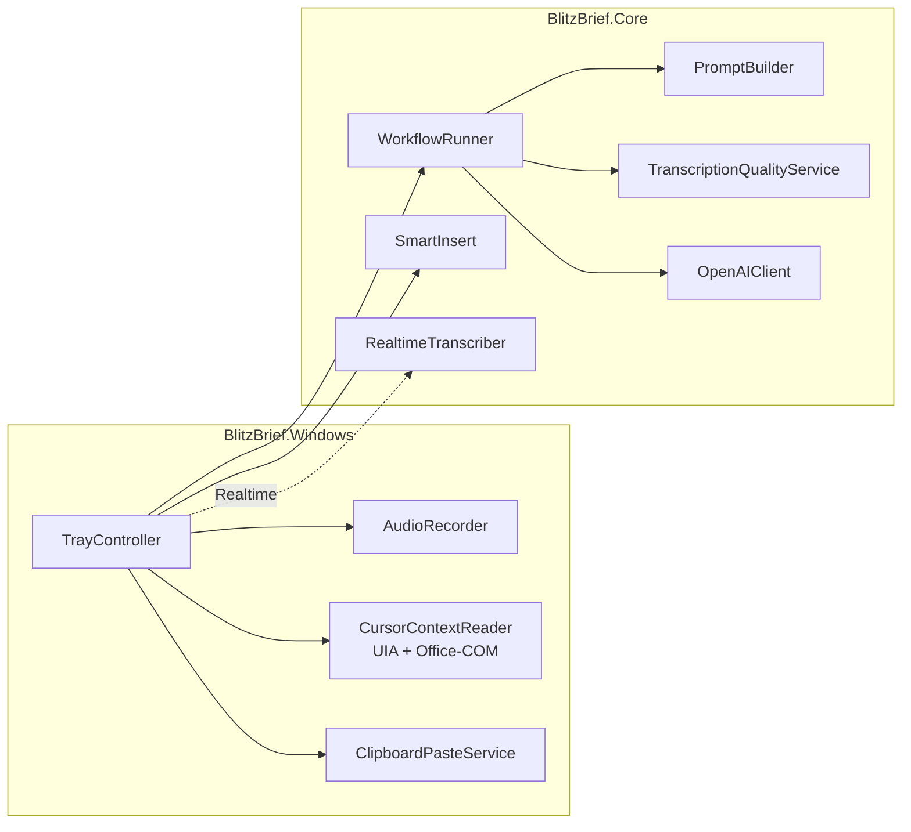
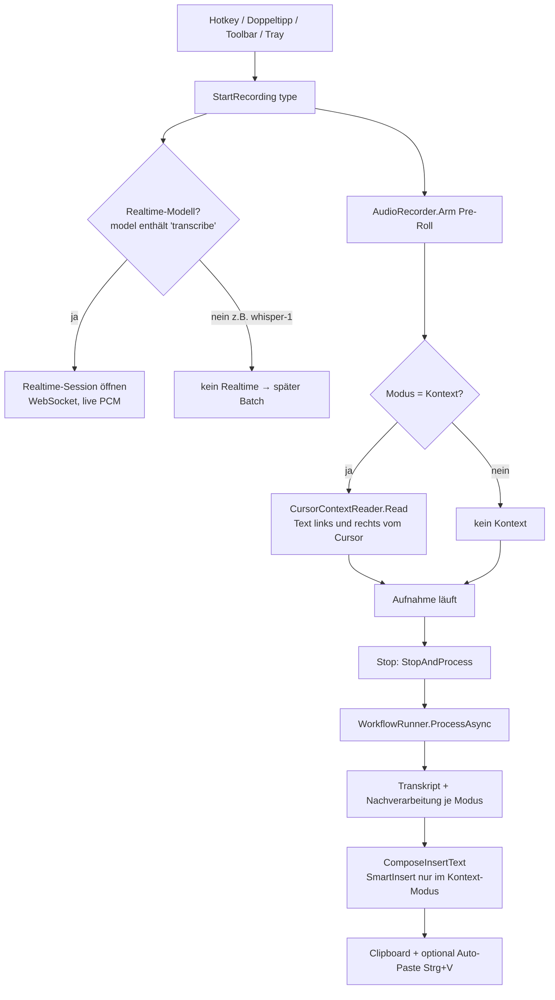
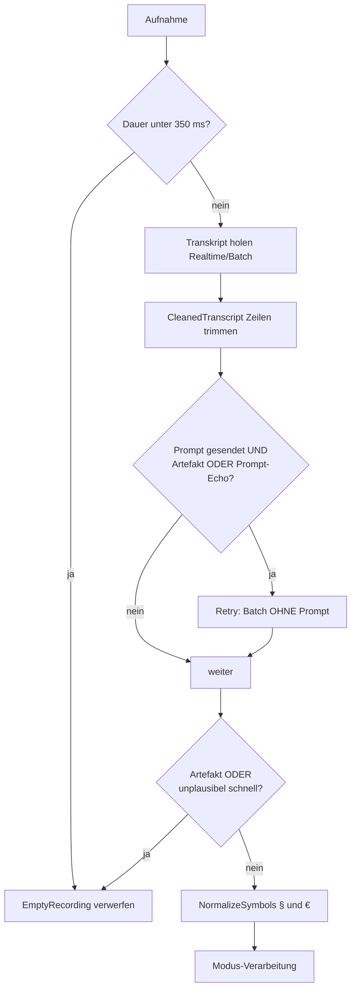
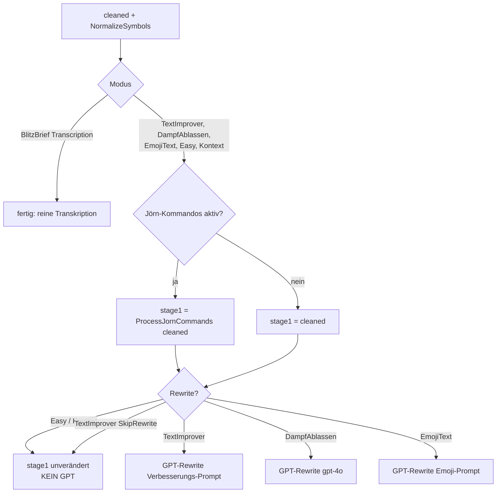
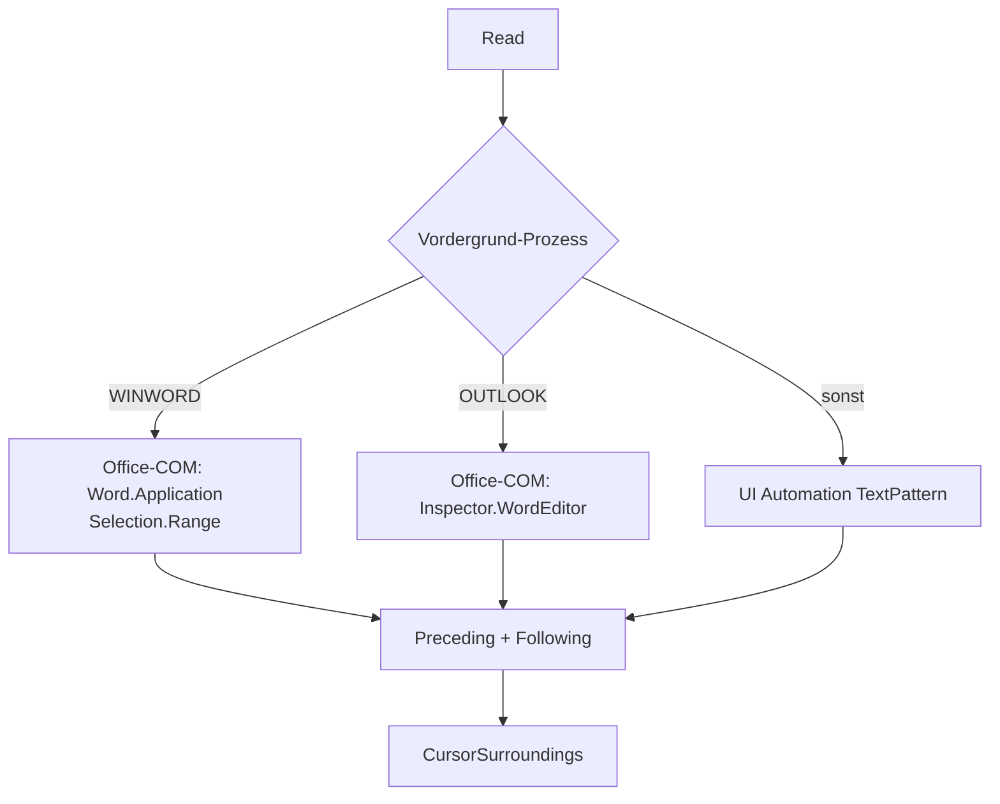
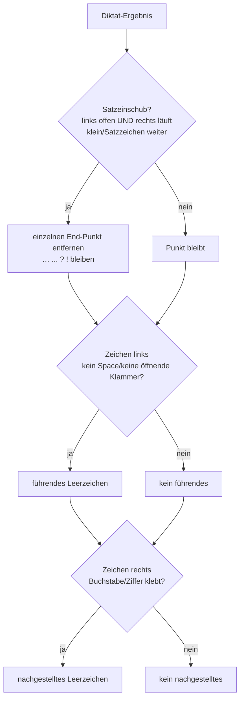

# BlitzBrief – Technische Dokumentation

> **Stand:** 2026-06-27 · Basis-Commit `64148c4` + Working-Tree (Blitzbrief-Kontext / SmartInsert)
> Generiert über `/doku-erstellen`. Bei Code-Änderungen neu generieren.

BlitzBrief ist eine Windows-Diktier-App (.NET 10, WPF + WinForms-Tray). Per Hotkey/Doppeltipp wird Audio aufgenommen, über OpenAI transkribiert, je nach **Modus** nachverarbeitet und an der Cursorposition der aktiven Anwendung eingefügt.

---

## 1. Projektstruktur

| Projekt | Zweck | Wichtige Typen |
|---|---|---|
| **BlitzBrief.Core** | Plattformneutrale Logik: Pipelines, Prompts, Textverarbeitung | `WorkflowRunner`, `PromptBuilder`, `TranscriptionQualityService`, `SentenceContext`, `SmartInsert`, `RealtimeTranscriber`, `AppSettings` |
| **BlitzBrief.Windows** | UI, Audio, Tastatur, Cursor-Zugriff | `TrayController`, `AudioRecorder`, `ClipboardPasteService`, `CursorContextReader`, `FloatingToolbarWindow`, `SettingsWindow` |
| **BlitzBrief.Tests** | xUnit-Tests der Core-Logik | — |

---

## 2. Gesamtablauf (alle Modi)

**Auslöser** (`TrayController`): globale Hotkeys, Doppeltipp auf einen Modifier (Wispr-Stil), Klick in der Floating-Toolbar oder im Tray-Menü. Toolbar/Overlay sind `WS_EX_NOACTIVATE` → der Tastaturfokus bleibt in der Zielanwendung (wichtig fürs Einfügen **und** fürs Cursor-Lesen).

**Pre-Roll:** Das Mikrofon läuft in einem kurzen Ringpuffer (Default 300 ms), damit Wortanfänge nicht verloren gehen und das Diktat verzögerungsfrei startet.

---

## 3. Audio & Transkription: Realtime vs. Batch

| | Realtime (Default) | Batch (Fallback / Kontext) |
|---|---|---|
| Transport | WebSocket `wss://api.openai.com/v1/realtime?intent=transcription` (GA) | Multipart-Upload `/v1/audio/transcriptions` |
| Wann | `UseRealtimeTranscription` an **und** Modell enthält `transcribe` | bei Fehler/Timeout der Realtime-Session **oder** Modus Kontext (whisper-1) |
| Audio | 24 kHz, 16-bit, mono PCM, live `input_audio_buffer.append` → `commit` | gepuffertes PCM → WAV in-memory |
| Latenz | niedrig (während des Sprechens) | erst nach Stopp |

Der GA-Wire-Flow: `session.update` (Typ `transcription`, Modell, Sprache, `prompt`, `turn_detection:null`) → `input_audio_buffer.append` (base64-PCM) → `commit` → Ergebnis-Event `…input_audio_transcription.completed`. Bei jedem Realtime-Fehler fällt `WorkflowRunner` transparent auf den Batch-Upload des gepufferten PCM zurück.

---

## 4. Qualitäts-Schutz (`TranscriptionQualityService`)

Vor und nach der Transkription greifen mehrere Filter gegen leere Aufnahmen, Prompt-Echos und Halluzinationen:

| Prüfung | Schwelle / Logik |
|---|---|
| `ShouldRejectRecording` | Dauer < **350 ms** → verwerfen |
| `MinPromptAudioSeconds` | < **0,9 s** → keine Prompt-Hinweise senden (sonst Echo) |
| `IsLikelyArtifact` | leer; oder < 1 s & < 4 Zeichen; oder < 2 s & bekannte Floskel („Untertitel der Amara.org-Community", „Danke fürs Zuschauen", …) |
| `IsPromptEcho` | ≥ **6** Wörter **und** ≥ **80 %** Wortüberlappung mit dem gesendeten Prompt → Echo → prompt-loser Retry |
| `IsImplausiblyFast` | ≥ **12** Wörter **und** > **8 Wörter/Sek.** → Halluzination (physikalisch unmögliche Sprechrate, z. B. erfundene AGB-Textwand) → verwerfen |

---

## 5. Whisper-Prompt (`PromptBuilder.BuildWhisperPrompt`)

Der Transkriptions-Prompt biast Schreibweisen/Stil. Er wird in **beiden** Pfaden identisch gebaut (Realtime-Start mit `hasEnoughAudio: true`, Batch mit bekannter Dauer) und besteht aus bis zu drei Teilen:

1. **Sprachvorgabe** (nur bei `de`/`en`): „Transkribiere ausschließlich auf Deutsch/Englisch."
2. **Eigenbegriffe** (falls `CustomTerms` gesetzt): „Verwende für folgende Eigennamen und Fachbegriffe exakt diese Schreibweise: …" (biast nachweislich stärker als Fließtext-Beispiele).
3. **Kommando-Hinweise** (nur bei Jörn-Verarbeitung, siehe §7): juristischer Kontext + „§ statt Paragraf, € statt Euro" + Liste der wörtlich zu transkribierenden Diktierbefehle.

Im **Kontext-Modus** wird zusätzlich der angefangene Satz links vom Cursor **ans Prompt-Ende** gehängt (siehe §8).

---

## 6. Modi & Pipelines

Sechs Modi (`WorkflowType`). Gemeinsam ist die Transkription + der Qualitäts-Schutz aus §4; danach unterscheidet sich die Nachverarbeitung:

| Modus | DisplayName | Default-Hotkey | Jörn-Kommandos | GPT-Rewrite | Transkriptionsmodell |
|---|---|---|---|---|---|
| `Transcription` | BlitzBrief | Strg+Umschalt+Leer | nein | nein | Einstellung (Realtime) |
| `TextImprover` | Text verbessern | Strg+Umschalt+1 | nur bei Stil „Jörn 2" | ja (außer SkipRewrite) | Einstellung (Realtime) |
| `DampfAblassen` | Ärger beruhigen | Strg+Umschalt+2 | nein | ja (gpt-4o) | Einstellung (Realtime) |
| `EmojiText` | Emoji ergänzen | Strg+Umschalt+3 | nein | ja | Einstellung (Realtime) |
| `BlitzBriefEasy` | Blitzbrief-Easy | Strg+Win | **ja** | **nein** | Einstellung (Realtime) |
| `BlitzBriefKontext` | Blitzbrief-Kontext | Strg+Umschalt+4 | **ja** | **nein** | **whisper-1 (Batch)** |

`UsesJornCommands` ist `true` für **Easy**, **Kontext** und **TextImprover mit Stil „Jörn 2"** (`TextTone.JornCommands`). Nur dann werden Kommando-Hinweise im Prompt gesendet **und** die Kommandoersetzung (§7) angewandt.

### Modelle & Temperaturen beim Rewrite

| Modus | Modell | Temperatur | System-Prompt |
|---|---|---|---|
| TextImprover | `RewriteModel` (Default `gpt-4o-mini`) | 0,0 bei Jörn-Stil, sonst 0,3 | `BuildTextImprovementPrompt` (Stil + Kontext + Eigenbegriffe) |
| DampfAblassen | `gpt-4o` (fest) | 0,4 | `DampfAblassen.SystemPrompt` (deeskalierende Umformulierung) |
| EmojiText | `RewriteModel` | 0,3 | `BuildEmojiPrompt` (Dichte: wenig/mittel/viel) |

### Stile (`TextTone`) für „Text verbessern"

`Formal`, `Neutral`, `Casual` (allgemeiner Lektor-Prompt mit Tonvorgabe), `JornMinimal` (nur Füllwörter raus, Struktur erhalten), `JornCommands` („Jörn 2": Füllwörter raus + Kommandoersetzung + Halbsatz-Regeln, kein Umformulieren).

---

## 7. Jörn-2-Kommandoverarbeitung (`TranscriptionQualityService`)

Gesprochene Diktierbefehle werden wörtlich transkribiert (per Prompt geprimt) und anschließend deterministisch in Satzzeichen/Layout umgesetzt. Zwei Stufen:

**(a) `NormalizeCommands`** – Regex-Normalisierung der häufigen Whisper-Schreibvarianten auf eine Normalform, z. B. `Satz Ende`/`satzende` → `Satzende`, `Doppel Punkt` → `Doppelpunkt`.

**(b) `ReplaceCommands`** – Sentinel-Verfahren in drei Schritten:
1. Kommandowörter → eindeutige Private-Use-Sentinels (U+E000…).
2. Pro Sentinel die umgebenden Whisper-„Pausenzeichen" (Komma/Gedankenstrich/Punkt) verschlucken und das Zielzeichen mit kategoriegerechtem Spacing einsetzen.
3. Restglättung (doppelte Leerzeichen, Leerzeichen vor schließenden Zeichen), Einrückungen am Zeilenanfang bleiben erhalten.

Die Kategorien (`CommandKind`) bestimmen das Spacing: `TightPunctuation` (`, ; : . ! ?` hängt links an), `DashPunctuation` (`—` beidseitig Leerzeichen), `OpenBracket`/`CloseBracket` (`( )` `"` hängt rechts/links), `Newline`, `Indent`.

### Kommando-Tabelle

| Gesprochen | Ergebnis | Kategorie |
|---|---|---|
| Komma | `,` | Tight |
| Satzende | `.` | Tight |
| Doppelpunkt | `:` | Tight |
| Semikolon | `;` | Tight |
| Ausrufezeichen | `!` | Tight |
| Fragezeichen | `?` | Tight |
| Gedankenstrich | `—` | Dash |
| Klammer auf / Klammer zu | `(` / `)` | Open/Close |
| Anführungszeichen auf / zu | `"` | Open/Close |
| neue Zeile | Zeilenumbruch | Newline |
| neuer Absatz / Leerzeile | Doppelter Umbruch | Newline |
| Text einrücken | 4 Leerzeichen | Indent |

### Symbol-Normalisierung (`NormalizeSymbols`, alle Modi)

Deterministisch erzwungen, sobald eine Ziffer folgt – unabhängig vom Prompt:

- `\bParagra(f|ph)(en|s)?\s+(?=\d)` → `§ ` (z. B. „Paragraph 323" → „§ 323").
- `(\d(?:[.,]?\d)*)\s*Euro\b` → `$1 €` (z. B. „500 Euro" → „500 €").

---

## 8. Blitzbrief-Kontext: Cursor-Kontext & Smart-Insert

Der Kontext-Modus = Easy-Verhalten **plus** Fortsetzung des angefangenen Satzes links vom Cursor.

### 8.1 Warum whisper-1 (Batch)

Per Spike + OpenAI-Doku belegt: Nur **whisper-1** setzt einen angefangenen Satz grammatisch korrekt fort (Artikel klein, Substantiv groß), wenn der Vortext als Prompt-Ende mitgegeben wird. `gpt-4o-(mini-)transcribe` schreibt Satzanfänge per Formatter **immer groß** und ignoriert jeden Fortsetzungs-Prompt. whisper-1 ist batch-only → `TranscriptionModelFor` liefert für diesen Modus `whisper-1`, wodurch der Realtime-Pfad automatisch übersprungen wird. whisper-1 wertet nur die letzten ~224 Tokens des Prompts aus → der Vortext steht am **Ende**.

### 8.2 Cursor lesen (`CursorContextReader`)

Zerstörungsfrei (kein Clipboard-Trick), auf eigenem MTA-Thread mit 600-ms-Timeout. Strategie-Kette:

- **UIA:** `AutomationElement.FocusedElement` → `TextPattern` → vom Cursor (`GetSelection`) je 400 Zeichen nach links und 160 nach rechts spannen, `GetText`.
- **Office-COM:** `GetActiveObject` (selbst via ole32/oleaut32 P/Invoke, da `Marshal.GetActiveObject` in .NET fehlt) → `Document.Range`. Outlook-Mailtext ist ein Word-Dokument (`WordEditor`).
- Fällt etwas aus (App ohne Textzugriff, Timeout), gibt es schlicht keinen Kontext → der Modus verhält sich wie Easy.

### 8.3 Satz extrahieren (`SentenceContext.CurrentSentence`)

Aus dem linken Vortext-Blob wird der Teil **hinter dem letzten Satzende** (`. ! ?` oder Zeilenumbruch) genommen; `: ;` gelten **nicht** als Grenze. Endet der Vortext direkt auf einem Satzende (oder ist leer) → `null` (kein offener Satz). Bei Überlänge wird vorne auf 300 Zeichen gekürzt. Dieser Satz wird ans Whisper-Prompt-Ende gehängt.

### 8.4 Smart-Insert (`SmartInsert.Format`)

Nach der Transkription wird das Ergebnis passend zur Einfügestelle geformt (nur im Kontext-Modus; andere Modi hängen wie bisher nur ein Leerzeichen an):

- **Führendes Leerzeichen:** wenn links ein Buchstabe/Ziffer/schließendes Satzzeichen steht; **nicht** bei Whitespace/Zeilenanfang oder öffnender Klammer/Slash (`( [ { „ « / …`).
- **Nachgestelltes Leerzeichen:** wenn rechts direkt ein Buchstabe/Ziffer klebt; **nicht** bei vorhandenem Leerzeichen oder anhängendem Satzzeichen (`. , ; : ! ? ) …`); am Feldende immer (Verkettung).
- **Auto-Punkt entfernen:** nur bei klarem Einschub (links offener Satz **und** rechts geht klein oder mit Satzzeichen weiter). Ellipse `…`/`...`, `?`, `!` bleiben erhalten.

---

## 9. Einfügen (`ClipboardPasteService`)

`CopyText` legt den (per `ComposeInsertText` geformten) Text in die Zwischenablage; bei `AutoPaste` wird `Strg+V` per `SendInput` injiziert. Vorher wird gewartet, bis physisch gehaltene Modifier (z. B. der Hotkey selbst) losgelassen sind, damit aus `Strg+V` nicht versehentlich `Strg+Alt+V` wird.

---

## 10. Einstellungen (`AppSettings`)

Sprache, Hotkey-Modus (Toggle/Hold), Doppeltipp-Modifier, Pre-Roll, `UseRealtimeTranscription`, Transkriptions-/Rewrite-Modell, Eigenbegriffe, pro-Modus-Prompts/Stile, `AutoPaste`, Debug-Modus. Persistenz als JSON via `SettingsStore`; `Normalize` füllt fehlende Hotkeys aus den Defaults auf (so erhalten Bestands-Installationen neue Modi automatisch).
