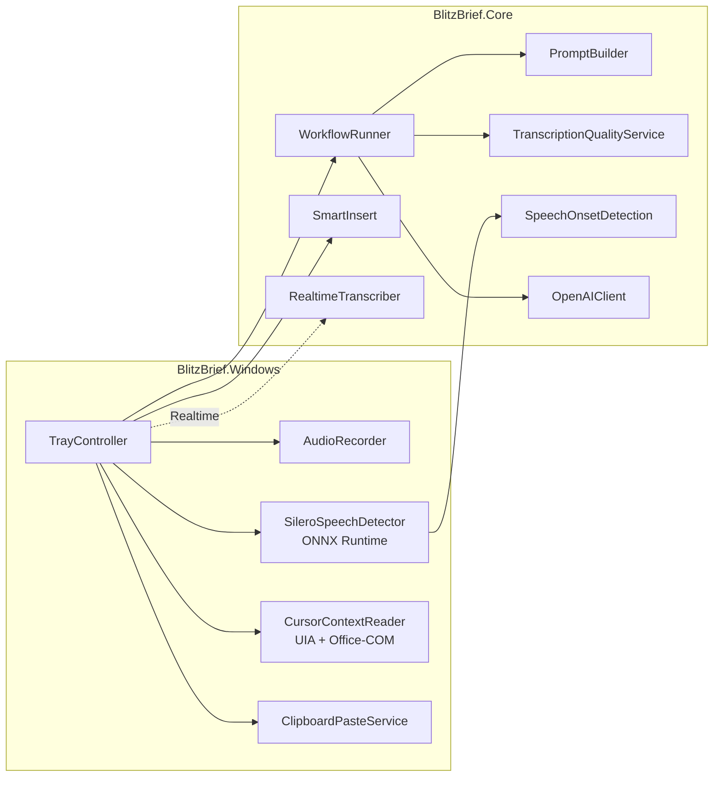
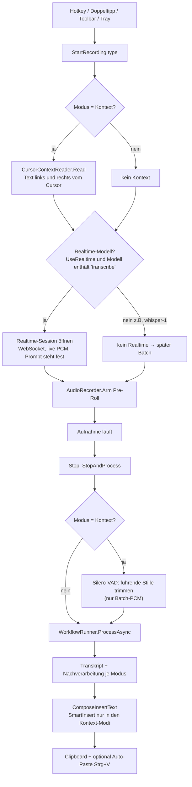
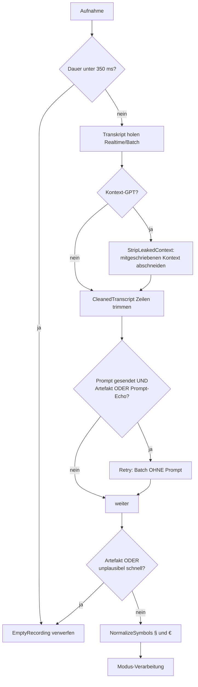
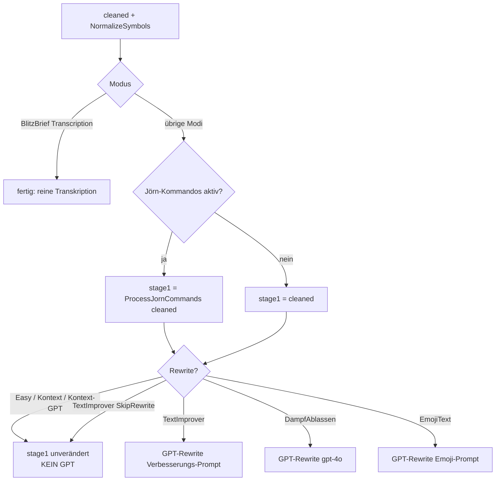
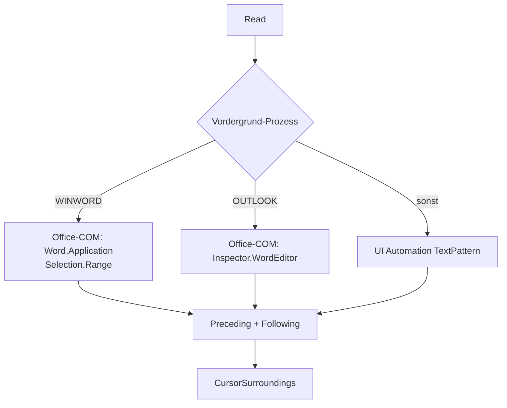
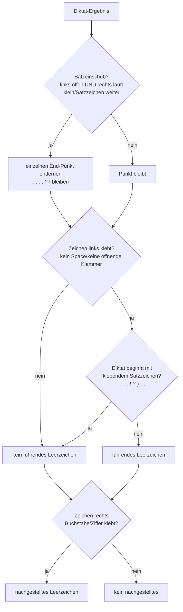

# BlitzBrief – Technische Dokumentation

> **Stand:** 2026-06-29 · Basis-Commit `2b746aa` + Working-Tree (Modus „Blitzbrief-Kontext (GPT)", Silero-VAD-Trim, Realtime für Kontext-GPT, Leakage-Guard, Hotkey-Default Strg+Leer)
> Generiert über `/doku-erstellen`. Bei Code-Änderungen neu generieren.

BlitzBrief ist eine Windows-Diktier-App (.NET 10, WPF + WinForms-Tray). Per Hotkey/Doppeltipp wird Audio aufgenommen, über OpenAI transkribiert, je nach **Modus** nachverarbeitet und an der Cursorposition der aktiven Anwendung eingefügt.

---

## 1. Projektstruktur

| Projekt | Zweck | Wichtige Typen |
|---|---|---|
| **BlitzBrief.Core** | Plattformneutrale Logik: Pipelines, Prompts, Textverarbeitung | `WorkflowRunner`, `PromptBuilder`, `TranscriptionQualityService`, `SentenceContext`, `SmartInsert`, `SpeechOnsetDetection`, `RealtimeTranscriber`, `AppSettings` |
| **BlitzBrief.Windows** | UI, Audio, Tastatur, Cursor-Zugriff, Silero-Inferenz | `TrayController`, `AudioRecorder`, `SileroSpeechDetector`, `ClipboardPasteService`, `CursorContextReader`, `FloatingToolbarWindow`, `SettingsWindow`, `DebugOutputWindow` |
| **BlitzBrief.Tests** | xUnit-Tests der Core-Logik | — |



---

## 2. Gesamtablauf (alle Modi)



**Auslöser** (`TrayController`): globale Hotkeys, Doppeltipp auf einen Modifier (Wispr-Stil), Klick in der Floating-Toolbar oder im Tray-Menü. Toolbar/Overlay sind `WS_EX_NOACTIVATE` → der Tastaturfokus bleibt in der Zielanwendung (wichtig fürs Einfügen **und** fürs Cursor-Lesen).

**Reihenfolge in `StartRecording`:** In den Kontext-Modi wird der Cursor-Kontext **vor** dem Öffnen der Realtime-Session gelesen, weil deren Prompt (bei Kontext-GPT der Lücken-Prompt) zur Session-Erstellung feststehen muss. Der durchlaufende Pre-Roll-Puffer überbrückt die kurze Lesezeit, daher kein Audioverlust.

**Pre-Roll:** Das Mikrofon läuft in einem kurzen Ringpuffer (Default 300 ms), damit Wortanfänge nicht verloren gehen und das Diktat verzögerungsfrei startet.

---

## 3. Audio & Transkription: Realtime vs. Batch

| | Realtime | Batch (Fallback / whisper-1) |
|---|---|---|
| Transport | WebSocket `wss://api.openai.com/v1/realtime?intent=transcription` (GA) | Multipart-Upload `/v1/audio/transcriptions` |
| Wann | `UseRealtimeTranscription` an **und** Modell enthält `transcribe` | bei Fehler/Timeout der Realtime-Session **oder** Modus „Blitzbrief-Kontext" (whisper-1, batch-only) |
| Audio | 24 kHz, 16-bit, mono PCM, live `input_audio_buffer.append` → `commit` | gepuffertes PCM → WAV in-memory |
| Latenz | niedrig (während des Sprechens) | erst nach Stopp |

Der GA-Wire-Flow: `session.update` (Typ `transcription`, Modell, Sprache, `prompt`, `turn_detection:null`) → `input_audio_buffer.append` (base64-PCM) → `commit` → Ergebnis-Event `…input_audio_transcription.completed`. Bei jedem Realtime-Fehler fällt `WorkflowRunner` transparent auf den Batch-Upload des gepufferten PCM zurück.

`WorkflowResult.UsedRealtime` hält fest, ob das **finale** Transkript aus dem Realtime-Stream kam (oder ein Batch-(Retry) übernommen hat). Das Debug-Fenster zeigt das oben als Lämpchen (grün = Realtime, grau = Batch) samt der Dauer **ab Hotkey-Loslassen bis zum Einfügen** der Antwort im Format „x,xx Sek" (derselbe Stopwatch, der auch die „fertig (… ms)"-Statuszeile speist).

---

## 4. Silero-VAD: führende Stille trimmen (`SileroSpeechDetector` + `SpeechOnsetDetection`)

In **beiden** Kontext-Modi (`IsKontextMode`) wird vor der Batch-Transkription die führende Stille bis zum Sprachbeginn abgeschnitten – das reduziert Halluzinationen bei langem Vorlauf und liefert einen sauberen Wortanlaut. Auf dem Realtime-Pfad greift der Trim nicht (Live-Stream); dort übernimmt die Server-VAD, der Batch-Fallback trimmt weiterhin.

- **Modell:** Silero-VAD v5 (`silero_vad.onnx`, MIT, eingebettet), ONNX Runtime CPU.
- **Fenster:** 512 Samples (32 ms) bei 16 kHz. **Wichtig:** v5 erwartet pro Schritt **64 Samples Kontext** aus dem Vorfenster **vor** den 512 neuen Samples (insgesamt 576). Ohne diesen Vorlauf bleibt die Sprachwahrscheinlichkeit ~0 und der LSTM-State driftet weg – es würde nie ein Onset erkannt.
- **Onset-Logik (`SpeechOnsetDetection.FindOnset`):** erstes Fenster, ab dem die Wahrscheinlichkeit für mindestens `minSpeechMs` (Default **100 ms**) über der Schwelle (**0,5**) bleibt (gegen Klick-Fehlauslöser); davor bleiben `padMs` (Default **100 ms**) als Sicherheitsrand erhalten.
- **Robustheit:** Schlägt das Laden des Modells fehl (Packaging/Plattform), ist der Detector „nicht verfügbar" und es wird einfach nicht getrimmt. Inferenzfehler brechen das Diktat nie ab.
- **Debug:** Das Debug-Fenster zeigt im Kontext-Modus die Sprachwahrscheinlichkeit pro Fenster als Balkendiagramm samt Schwellen- und Schnitt-Linie.

---

## 5. Qualitäts-Schutz (`TranscriptionQualityService`)

Vor und nach der Transkription greifen mehrere Filter gegen leere Aufnahmen, Prompt-Echos und Halluzinationen:



| Prüfung | Schwelle / Logik |
|---|---|
| `ShouldRejectRecording` | Dauer < **350 ms** → verwerfen |
| `MinPromptAudioSeconds` | < **0,9 s** → keine Eigenbegriffe/Kommando-Hinweise senden (sonst Echo) |
| `IsLikelyArtifact` | leer; oder < 1 s & < 4 Zeichen; oder < 2 s & bekannte Floskel („Untertitel der Amara.org-Community", „Danke fürs Zuschauen", …) |
| `IsPromptEcho` | ≥ **6** Wörter **und** ≥ **80 %** Wortüberlappung mit dem gesendeten Prompt → Echo → prompt-loser Retry |
| `IsImplausiblyFast` | ≥ **12** Wörter **und** > **8 Wörter/Sek.** → Halluzination (physikalisch unmögliche Sprechrate, z. B. erfundene AGB-Textwand) → verwerfen |
| `StripLeakedContext` | nur Kontext-GPT: schneidet eine zusammenhängende Kontext-Wortfolge (**≥ 2 Wörter**) direkt an der jeweiligen Grenze ab, falls das Modell den Cursor-Kontext mitgeschrieben hat (konservativ → echtes Diktat bleibt unangetastet) |

---

## 6. Transkriptions-Prompts (`PromptBuilder`)

Der Prompt biast Schreibweisen/Stil und wird in **beiden** Pfaden identisch gebaut (Realtime-Start mit `hasEnoughAudio: true`, Batch mit bekannter Dauer).

**`BuildWhisperPrompt`** – Basis-Prompt aus bis zu drei Teilen:
1. **Sprachvorgabe** (nur bei `de`/`en`): „Transkribiere ausschließlich auf Deutsch/Englisch."
2. **Eigenbegriffe** (falls `CustomTerms` gesetzt): „Verwende für folgende Eigennamen und Fachbegriffe exakt diese Schreibweise: …".
3. **Kommando-Hinweise** (nur bei Jörn-Verarbeitung, siehe §8): juristischer Kontext + „§ statt Paragraf, € statt Euro" + Liste der wörtlich zu transkribierenden Diktierbefehle.

**`BuildWorkflowWhisperPrompt`** (Modus „Blitzbrief-Kontext", whisper-1): hängt zusätzlich den angefangenen Satz **links** vom Cursor **ans Prompt-Ende** (siehe §9.3) – auch bei kurzem Audio (für korrekte Klein-Fortsetzung).

**`BuildKontextGapPrompt`** (Modus „Blitzbrief-Kontext (GPT)"): die Basis-Hinweise **plus** – davon getrennt – die Cursor-Nachbarschaft mit einer Einfügelücke. Das instruktionsfähige `gpt-4o-(mini-)transcribe` versteht so, **wohin** das Diktat gehört:

```
[Sprache / Eigenbegriffe / Kommando-Hinweise]

An der mit ___ markierten Stelle wird gesprochener Text in einen bestehenden Text eingefügt:
"{links} ___ {rechts}"
Transkribiere ausschließlich die Audioaufnahme – den Text, der an die Stelle ___ gehört –
wortgetreu auf Deutsch. Gib nur diesen eingefügten Text aus, nicht den umgebenden Kontext.
```

Ohne jeden Kontext (links **und** rechts leer) fällt der Prompt auf die reinen Hinweise zurück.

---

## 7. Modi & Pipelines

Sieben Modi (`WorkflowType`). Gemeinsam ist die Transkription + der Qualitäts-Schutz aus §5; danach unterscheidet sich die Nachverarbeitung:



| Modus | DisplayName | Default-Hotkey | Jörn-Kommandos | GPT-Rewrite | Transkriptionsmodell |
|---|---|---|---|---|---|
| `Transcription` | BlitzBrief | Strg+Alt+Leer | nein | nein | Einstellung (Realtime) |
| `TextImprover` | Text verbessern | Strg+Alt+1 | nur bei Stil „Jörn 2" | ja (außer SkipRewrite) | Einstellung (Realtime) |
| `DampfAblassen` | Ärger beruhigen | Strg+Alt+2 | nein | ja (gpt-4o) | Einstellung (Realtime) |
| `EmojiText` | Emoji ergänzen | Strg+Alt+3 | nein | ja | Einstellung (Realtime) |
| `BlitzBriefEasy` | Blitzbrief-Easy | Strg+Win | **ja** | **nein** | Einstellung (Realtime) |
| `BlitzBriefKontext` | Blitzbrief-Kontext | Strg+Umschalt | **ja** | **nein** | **whisper-1 (Batch)** |
| `BlitzBriefKontextGpt` | Blitzbrief-Kontext (GPT) | **Strg+Leer** | **ja** | **nein** | **`KontextGptModel`** (Realtime + Batch) |

> Easy und Kontext sind **reine Modifier-Hotkeys** (Strg+Win bzw. Strg+Umschalt). Damit Strg+Umschalt nicht bei jeder anderen Kombination mitfeuert, liegen die übrigen Hotkeys bewusst auf **Strg+Alt** statt Strg+Umschalt.

`UsesJornCommands` ist `true` für **Easy**, **Kontext**, **Kontext-GPT** und **TextImprover mit Stil „Jörn 2"** (`TextTone.JornCommands`). Nur dann werden Kommando-Hinweise im Prompt gesendet **und** die Kommandoersetzung (§8) angewandt.

### Modelle & Temperaturen beim Rewrite

| Modus | Modell | Temperatur | System-Prompt |
|---|---|---|---|
| TextImprover | `RewriteModel` (Default `gpt-4o-mini`) | 0,0 bei Jörn-Stil, sonst 0,3 | `BuildTextImprovementPrompt` (Stil + Kontext + Eigenbegriffe) |
| DampfAblassen | `gpt-4o` (fest) | 0,4 | `DampfAblassen.SystemPrompt` (deeskalierende Umformulierung) |
| EmojiText | `RewriteModel` | 0,3 | `BuildEmojiPrompt` (Dichte: wenig/mittel/viel) |

### Stile (`TextTone`) für „Text verbessern"

`Formal`, `Neutral`, `Casual` (allgemeiner Lektor-Prompt mit Tonvorgabe), `JornMinimal` (nur Füllwörter raus, Struktur erhalten), `JornCommands` („Jörn 2": Füllwörter raus + Kommandoersetzung + Halbsatz-Regeln, kein Umformulieren).

---

## 8. Jörn-2-Kommandoverarbeitung (`TranscriptionQualityService`)

Gesprochene Diktierbefehle werden wörtlich transkribiert (per Prompt geprimt) und anschließend deterministisch in Satzzeichen/Layout umgesetzt. Zwei Stufen:

**(a) `NormalizeCommands`** – Regex-Normalisierung der häufigen Whisper-Schreibvarianten auf eine Normalform, z. B. `Satz Ende`/`satzende` → `Satzende`, `Doppel Punkt` → `Doppelpunkt`.

**(b) `ReplaceCommands`** – Sentinel-Verfahren in drei Schritten:
1. Kommandowörter → eindeutige Private-Use-Sentinels (U+E000…).
2. Pro Sentinel die umgebenden Whisper-„Pausenzeichen" (Komma/Gedankenstrich/Punkt) verschlucken und das Zielzeichen mit kategoriegerechtem Spacing einsetzen.
3. Restglättung (doppelte Leerzeichen, Leerzeichen vor schließenden Zeichen), Einrückungen am Zeilenanfang bleiben erhalten.

Die Kategorien (`CommandKind`) bestimmen das Spacing: `TightPunctuation` (`, ; : . ! ?` hängt links an), `DashPunctuation` (`—` beidseitig Leerzeichen), `OpenBracket`/`CloseBracket` (`( )` `"` hängt rechts/links), `Newline`, `Indent`.

### Kommando-Tabelle

| Gesprochen | Ergebnis | Kategorie |
|---|---|---|
| Komma | `,` | Tight |
| Satzende | `.` | Tight |
| Doppelpunkt | `:` | Tight |
| Semikolon | `;` | Tight |
| Ausrufezeichen | `!` | Tight |
| Fragezeichen | `?` | Tight |
| Gedankenstrich | `—` | Dash |
| Klammer auf / Klammer zu | `(` / `)` | Open/Close |
| Anführungszeichen auf / zu | `"` | Open/Close |
| neue Zeile | Zeilenumbruch | Newline |
| neuer Absatz / Leerzeile | Doppelter Umbruch | Newline |
| Text einrücken | 4 Leerzeichen | Indent |

### Symbol-Normalisierung (`NormalizeSymbols`, alle Modi)

Deterministisch erzwungen, sobald eine Ziffer folgt – unabhängig vom Prompt:

- `\bParagra(f|ph)(en|s)?\s+(?=\d)` → `§ ` (z. B. „Paragraph 323" → „§ 323").
- `(\d(?:[.,]?\d)*)\s*Euro\b` → `$1 €` (z. B. „500 Euro" → „500 €").

---

## 9. Kontext-Modi: Cursor-Kontext, Modellwahl & Smart-Insert

Beide Kontext-Modi = Easy-Verhalten **plus** Einfügen mitten in einen Satz. Sie lesen den Cursor-Kontext (§9.2), trimmen die führende Stille (§4) und formen das Ergebnis über Smart-Insert (§9.4). Sie unterscheiden sich nur im **Transkriptionsmodell und Prompt**.

### 9.1 whisper-1 (Batch) vs. gpt-4o-transcribe (GPT)

| | Blitzbrief-Kontext | Blitzbrief-Kontext (GPT) |
|---|---|---|
| Modell | whisper-1 (batch-only) | `KontextGptModel` (Realtime + Batch-Fallback) |
| Kontext | nur **links** (Vortext am Prompt-Ende) | **links + rechts** als Einfügelücke (`BuildKontextGapPrompt`) |
| Groß-/Klein | whisper-1 setzt einen offenen Satz nativ klein fort | vom Modell abhängig (s. u.) |
| Leakage-Guard | — | ja (`StripLeakedContext`) |

**Warum whisper-1 im klassischen Kontext-Modus:** Per Spike + OpenAI-Doku belegt – nur whisper-1 setzt einen angefangenen Satz grammatisch korrekt fort (Artikel klein, Substantiv groß), wenn der Vortext als Prompt-Ende mitgegeben wird. whisper-1 wertet nur die letzten ~224 Tokens aus → der Vortext steht am **Ende**. whisper-1 ist batch-only → `TranscriptionModelFor` liefert `whisper-1`, der Realtime-Pfad wird automatisch übersprungen.

**Warum es im GPT-Modus auf das Modell ankommt:** `gpt-4o-transcribe`/`-mini-transcribe` ignorieren einen reinen Fortsetzungs-Prompt und bringen ihren eigenen Formatter mit, der ein isoliert ausgegebenes Wort wie einen Satzanfang **groß** schreibt. In Messungen liefert **`gpt-4o-transcribe` (full)** an gleicher Stelle dennoch die korrekte Klein-Fortsetzung (es respektiert den klein­geschriebenen Lücken-Kontext), während `gpt-4o-mini-transcribe` das Wort meist groß schreibt. Das Modell ist über `KontextGptModel` wählbar (Default `gpt-4o-mini-transcribe`; für korrekte Groß-/Kleinschreibung **`gpt-4o-transcribe` empfohlen**). Der Realtime-Pfad nutzt `gpt-4o-transcribe`, der Lücken-Prompt wird bei der Session-Erstellung gesetzt.

### 9.2 Cursor lesen (`CursorContextReader`)

Zerstörungsfrei (kein Clipboard-Trick), auf eigenem MTA-Thread mit 600-ms-Timeout. Strategie-Kette:



- **UIA:** `AutomationElement.FocusedElement` → `TextPattern` → vom Cursor (`GetSelection`) je 400 Zeichen nach links und 160 nach rechts spannen, `GetText`.
- **Office-COM:** `GetActiveObject` (selbst via ole32/oleaut32 P/Invoke) → `Document.Range`. Outlook-Mailtext ist ein Word-Dokument (`WordEditor`).
- Fällt etwas aus (App ohne Textzugriff, Timeout), gibt es keinen Kontext → der Modus verhält sich wie Easy.

### 9.3 Satz extrahieren (`SentenceContext.CurrentSentence`)

Aus dem linken Vortext-Blob wird der Teil **hinter dem letzten Satzende** (`. ! ?` oder Zeilenumbruch) genommen; `: ;` gelten **nicht** als Grenze. Endet der Vortext direkt auf einem Satzende (oder ist leer) → `null` (kein offener Satz). Bei Überlänge wird vorne auf 300 Zeichen gekürzt. Dieser Satz ist im whisper-1-Modus der Vortext (Prompt-Ende) und in beiden Modi der **linke** Teil der Einfügelücke.

### 9.4 Smart-Insert (`SmartInsert.Format`)

Nach der Transkription wird das Ergebnis passend zur Einfügestelle geformt (nur in den Kontext-Modi; andere Modi hängen nur ein Leerzeichen an):



- **Führendes Leerzeichen:** nur wenn **beide Seiten der Klebestelle kleben** wollen – *links* ein Buchstabe/Ziffer/schließendes Satzzeichen (also **nicht** Whitespace/Zeilenanfang oder öffnende Klammer/Slash), **und** *rechts (= erstes Zeichen des Diktats)* **kein** nach links klebendes Satzzeichen. Beginnt das Diktat mit so einem „Right-Hugger" (`. , ; : ! ? ) ] } » ” › …`), entfällt das Leerzeichen (`…festgestellt` + `, dass` → `…festgestellt, dass`). Öffnende Anführungszeichen, `§` und Gedankenstrich (`–`/`—`) sind **keine** Right-Hugger und behalten ihr führendes Leerzeichen.
- **Nachgestelltes Leerzeichen:** wenn rechts direkt ein Buchstabe/Ziffer klebt; **nicht** bei vorhandenem Leerzeichen oder anhängendem Satzzeichen; am Feldende immer (Verkettung).
- **Auto-Punkt entfernen:** nur bei klarem Einschub (links offener Satz **und** rechts geht klein oder mit Satzzeichen weiter). Ellipse `…`/`...`, `?`, `!` bleiben erhalten.

---

## 10. Einfügen (`ClipboardPasteService`)

`CopyText` legt den (per `ComposeInsertText` geformten) Text in die Zwischenablage; bei `AutoPaste` wird `Strg+V` per `SendInput` injiziert. Vorher wird gewartet, bis physisch gehaltene Modifier (z. B. der Hotkey selbst) losgelassen sind, damit aus `Strg+V` nicht versehentlich `Strg+Alt+V` wird.

---

## 11. Einstellungen (`AppSettings`)

Sprache, Hotkey-Modus (Toggle/Hold, **Default Hold**), Doppeltipp-Modifier, Pre-Roll, `UseRealtimeTranscription`, Transkriptionsmodell, **`KontextGptModel`** (für „Blitzbrief-Kontext (GPT)", Default `gpt-4o-mini-transcribe`), Rewrite-Modell, Eigenbegriffe, pro-Modus-Prompts/Stile, `AutoPaste`, Debug-Modus. Persistenz als JSON via `SettingsStore`; `Normalize` füllt fehlende Hotkeys/Modelle aus den Defaults auf (so erhalten Bestands-Installationen neue Modi automatisch).

> **Hinweis (UI):** Die beiden **Modell-Dropdowns** (Transkriptionsmodell, Kontext-GPT-Modell) sind editierbar und werden beim Speichern über den **ausgewählten Eintrag** ausgelesen (nicht über `.Text`), da letzterer im Moment der Auswahl unzuverlässig ist.

In `SettingsWindow` setzt der Button **„Allgemeine Einstellungen zurücksetzen"** (`ResetGeneral_Click`) Sprache, Transkriptionsmodell, Hotkey-Modus (Halten), Auto-Einfügen, Echtzeit-Transkription, Doppeltipp und Pre-Roll gebündelt auf die Standardwerte (ohne Hotkey-Belegungen, Prompts oder Eigenbegriffe).
